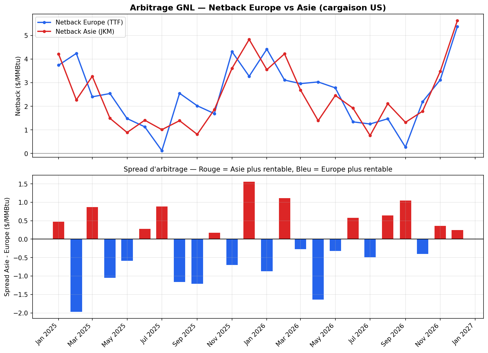

# LNG Arbitrage Calculator 🚢⛽

Un outil Python qui calcule, pour une cargaison de GNL exportée depuis les États-Unis, **quelle route est la plus rentable entre l'Europe et l'Asie** — en tenant compte de tous les coûts physiques de la chaîne logistique (liquéfaction, transport maritime, régazéification).



## 🎯 Contexte métier

Sur le marché mondial du GNL, une même cargaison produite aux États-Unis peut être envoyée vers plusieurs bassins de consommation. Le choix de la destination dépend du **netback** — le profit net une fois tous les coûts déduits — et non du simple prix de vente. Ce projet reproduit ce calcul de décision, central dans le trading physique de GNL.

```
netback_destination = prix_de_vente
                       − prix_d'achat_du_gaz (Henry Hub)
                       − coût_de_liquéfaction
                       − coût_de_transport_maritime
                       − coût_de_régazéification
```

La route avec le netback le plus élevé est celle qu'un trader choisirait.

## 📊 Ce que fait le projet

1. **Génère** des prix mensuels réalistes pour les 3 références mondiales du gaz : Henry Hub (US), TTF (Europe), JKM (Asie), avec saisonnalité hiver/été
2. **Calcule** le netback vers l'Europe et vers l'Asie pour chaque mois
3. **Détermine** automatiquement la route optimale et détecte les bascules dans le temps
4. **Visualise** l'évolution du spread d'arbitrage sur un graphique à deux volets
5. **Génère** une note de synthèse automatique, façon note de desk

## 🛠️ Stack technique

- **Python 3.12**
- **Pandas** — manipulation des séries de prix et calculs vectorisés
- **NumPy** — génération des données simulées (saisonnalité + bruit aléatoire)
- **Matplotlib** — visualisation

## 📁 Structure du projet

| Fichier | Rôle |
|---|---|
| `01_generate_data.py` | Génère 24 mois de prix simulés (Henry Hub, TTF, JKM) |
| `02_netback_calculation.py` | Calcule le netback par route et la décision optimale |
| `03_visualization.py` | Génère le graphique du spread d'arbitrage |
| `04_executive_summary.py` | Produit une note de synthèse automatique |

## ▶️ Utilisation

```bash
pip install pandas numpy matplotlib

python 01_generate_data.py        # génère prix_simules.csv
python 02_netback_calculation.py  # génère netback_results.csv
python 03_visualization.py        # génère le graphique
python 04_executive_summary.py    # affiche la note de synthèse
```

## 📈 Exemple de résultat

Sur la période simulée (24 mois), la route optimale bascule régulièrement entre l'Europe et l'Asie selon la saisonnalité régionale — confirmant la dynamique d'arbitrage active qui caractérise le marché GNL mondial, où aucun bassin ne domine durablement.

## 🔭 Pistes d'évolution

- Intégrer le **délai de transit** réel (≈10 jours vers l'Europe, ≈25 jours vers l'Asie) pour comparer un prix futur plutôt que le prix du même mois
- Ajouter une **contrainte de capacité** (nombre de méthaniers disponibles)
- Calculer une mesure de **risque/volatilité** sur le spread (VaR simplifiée)
- Connecter à de vraies données de marché (EIA pour Henry Hub, ICE pour TTF/JKM)

## ⚠️ Note sur les données

Les prix utilisés sont **simulés** (saisonnalité + bruit aléatoire calibrés sur des ordres de grandeur réels du marché), dans le but de démontrer la logique de calcul. Ce n'est pas une recommandation de trading.

---

*Projet réalisé dans le cadre de ma préparation à des postes en trading gaz/énergie.*
